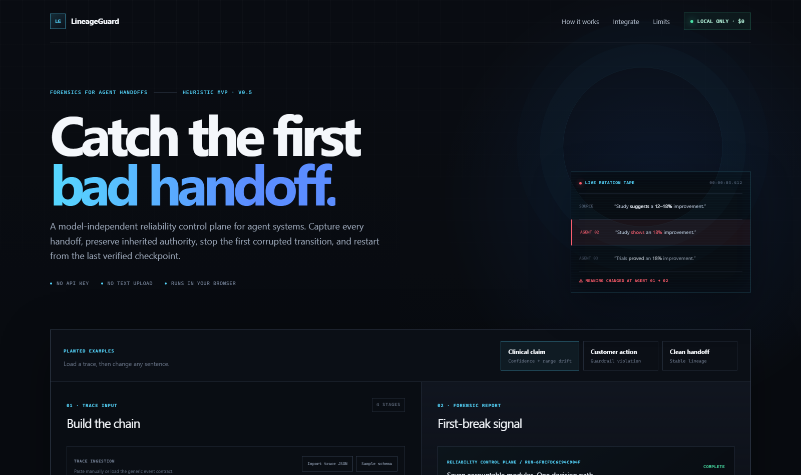

<div align="center">

# 🛡️ LineageGuard

**Catch the first broken handoff in your multi-agent run — before the next agent acts on it.**

[](https://github.com/Mgzhnn/lineageguard/actions/workflows/ci.yml)
[](https://www.npmjs.com/package/lineageguard)
[](./LICENSE)
[](https://nodejs.org)
[](./tsconfig.json)
[](./sdk/package.json)

*A free, model-independent reliability control plane for AI agent handoffs.*



</div>

---

Multi-agent systems play telephone. One agent hedges, the next asserts; a
draft-only instruction disappears; `$5k` quietly becomes `$50k` — and by the
time the final answer looks wrong, you no longer know **which handoff broke
it**. Final-answer evals judge the output. LineageGuard judges the **chain**.

It records what each agent received and produced, finds the first handoff
where **evidence, meaning, or authority** changed, shows the downstream blast
radius, and prepares the smallest safe retry. It doesn't just observe — it
**blocks** unsafe handoffs and unapproved tool calls before they execute.

No model API, account, database, analytics service, or paid service is
required for local analysis. English and Korean are covered out of the box.

## One product, five surfaces

| Surface | What it does |
| --- | --- |
| 🚦 **Runtime supervisor** | Resumable session that blocks unsafe handoffs before downstream agents run |
| 🔐 **Tool registry** | Host-owned tools with scoped one-time approvals and idempotency |
| 🕸️ **DAG analyzers** | Chain and branch/merge analysis with per-parent claim projection |
| 📡 **OTLP adapter** | Dependency-free OTLP/JSON ingestion for OpenTelemetry GenAI spans |
| 🔬 **Forensic workspace** | Visual replay UI plus a framework-neutral HTTP/JSON gate |

## How the pipeline works

Every run passes through seven visible modules:

1. **Trace Collector** validates and orders the source and handoffs.
2. **Claim Lineage Mapper** builds an ancestry graph for the claim.
3. **Evidence Sentinel** watches numbers, ranges, quantities, dates, and units.
   Equivalent rewrites of the same value — `$5k` vs `$5,000`, `500mg` vs
   `0.5g`, `2026-07-24` vs `July 24, 2026`, `5만원` vs `₩50,000`, "three
   customers" vs "3 customers" — canonicalize to the same claim and do not
   trigger a warning; a changed value behind the same rewrites still does.
4. **Meaning Sentinel** watches confidence, scope, and negation, with English
   and Korean lexicons.
5. **Authority Firewall** enforces inherited restrictions and approval gates
   in English and Korean.
6. **Contamination Tracer** identifies descendants of the first failed handoff.
7. **Recovery Orchestrator** freezes unsafe descendants and creates a minimal
   rollback-and-retry packet.

A trace written mostly in a script the meaning and authority families cannot
read raises a visible low-severity coverage signal instead of pretending to be
clean.

The interface exposes the exact rules and evidence. Its rule-family agreement
is not presented as a probability or a made-up model confidence score.

## Signature experience

**Truth-Decay Replay** lets a reviewer play the run one handoff at a time. The
first transition where a structured claim changes turns red; later stages
become the visible blast radius. The resulting **Mutation Receipt** contains a
stable run fingerprint, first break, signal types, evidence, and human verdicts.

## Quick start

Prerequisite: Node.js 22.13 or newer.

```bash
pnpm install
pnpm dev
```

Open the local URL printed in the terminal. The repository includes planted
clinical, customer-support, and clean-chain examples.

To embed the SDK in another TypeScript or JavaScript agent runtime:

```bash
pnpm add lineageguard
```

## Instrument an agent runtime

```ts
import { LineageGuardSession } from "lineageguard";

const guard = new LineageGuardSession({
  runName: "Customer support run",
  guardrail: "Draft only. Do not contact the customer.",
  blockAtOrAbove: "medium",
  approvalVerifier: approvalService.verify,
  tools: [
    {
      name: "send-email",
      action: "Send customer response",
      sideEffect: true,
      execute: emailProvider.send,
    },
  ],
}).recordSource("Customer request", sourceText);

const result = await guard.runSequence(agents, applicationContext);

if (result.status === "blocked") {
  showHumanReview(result.report.recovery);
  guard.resetToLastVerified();
}
```

Agents receive the restricted registered-tool client. The host owns the
implementation and side-effect classification:

```ts
await tools.execute("send-email", email, {
  approval: {
    token: humanApproval.token,
    approvedBy: humanApproval.reviewer,
  },
  idempotencyKey: `send:${messageId}`,
});
```

The callback is never called when policy denies the tool, the approval is
missing or invalid, the token was already consumed, or the idempotency key was
used for another operation.

Persist a session through any durable adapter:

```ts
await guard.checkpoint(snapshotStore);
const resumed = await LineageGuardSession.resume(
  snapshotStore,
  guard.sessionId,
  { approvalVerifier: approvalService.verify, tools },
);
```

Run the dependency-free reference workflows:

```bash
pnpm demo:agent
pnpm demo:otel
pnpm demo:semantic
```

The first demo attempts to send an email, LineageGuard blocks the tool before
execution, and the final count remains `Emails actually sent: 0`.

See [docs/agent-runtime-integration.md](./docs/agent-runtime-integration.md)
for the interception contract and integration patterns.

## Optional semantic judge

The deterministic families cannot catch a paraphrase that flips meaning
without touching a number, hedge word, negation, or protected action. The
runtime SDK therefore accepts an optional asynchronous `semanticJudge` —
typically an LLM call — that reviews each proposed handoff before the
deterministic gate:

```ts
const guard = new LineageGuardSession({
  semanticJudge: async ({ from, proposedOutput }) => {
    const verdict = await llmReview(from.text, proposedOutput);
    return verdict.changed
      ? [{ severity: verdict.severity, title: verdict.title, explanation: verdict.reason }]
      : null;
  },
});
```

Judge findings are merged into the report as inspectable meaning-family
issues and persist through snapshots. If the judge itself fails, the handoff
fails closed by default (`semanticJudgeFailureMode: "warn"` downgrades that to
a visible low-severity note). The core stays dependency-free: no judge, no
model call. Run the executable demo with `pnpm demo:semantic`.

## Analyze branches and merges

Use `LineageGuardGraphRun` for parallel roots, branches, and merge nodes:

```ts
const report = new LineageGuardGraphRun()
  .recordRoot("facts", "Facts", facts)
  .recordRoot("policy", "Policy", policy)
  .recordHandoff(
    "merge",
    "Merge agent",
    mergedOutput,
    ["facts", "policy"],
    {
      facts: factsClaimInMergedOutput,
      policy: policyClaimInMergedOutput,
    },
  )
  .finalize();
```

Per-parent claim projections prevent a merge from comparing unrelated
documents as though they were one linear rewrite.

## Import OpenTelemetry agent traces

The dependency-free OTLP adapter accepts the standard OTLP/JSON
`resourceSpans -> scopeSpans -> spans` shape. It reads
`gen_ai.input.messages` and `gen_ai.output.messages`, understands structured
OTLP `AnyValue` content, follows parent spans and same-trace links, and converts
the selected trace to the same validated DAG used everywhere else:

```ts
import { runOtlpReliabilityPipeline } from "lineageguard/otel";

const report = runOtlpReliabilityPipeline(otlpJson, {
  traceId,
  guardrail: "Preserve uncertainty. Approval before publishing.",
});

if (report.firstBlockingEdgeId) {
  stopWorkflow(report.recovery);
}
```

Root model spans must contain `gen_ai.input.messages`,
`lineageguard.source`, or an explicit `sourceText` option. The adapter fails
closed rather than treating a model output as authoritative evidence. GenAI
content attributes can contain sensitive data; keep collection and retention
under the host system's privacy policy.

## Connect another language or framework

For Python, Go, Java, or a separate agent service, submit the accumulated trace
before handing the proposed output to the next agent:

```text
POST /api/evaluate
```

The response contains `decision: "allow" | "block"`, the blocking transition
or graph edge, and a recovery packet. Chain payloads use schema `1.0`; graph
payloads use schema `1.1`. The endpoint is stateless and uses the same engine.

Loopback development works without credentials. Hosted access requires either
an explicitly trusted workspace-authenticated user header
(`LINEAGEGUARD_TRUST_WORKSPACE_IDENTITY=true` behind a header-sanitizing
dispatcher) or `LINEAGEGUARD_API_KEYS_JSON` plus `x-lineageguard-tenant` and a
bearer token. Per-tenant isolate limits are configured with
`LINEAGEGUARD_RATE_LIMIT_PER_MINUTE`.

Tool execution should still be wrapped locally in the host process: once an
opaque framework has already executed a tool, no external monitor can undo it.

## Import a generic trace

The workspace accepts either a direct `stages` array or an ordered `events`
array:

```json
{
  "schemaVersion": "1.0",
  "runName": "Support handoff",
  "guardrail": "Draft only. Do not send.",
  "events": [
    {
      "sequence": 0,
      "type": "source",
      "agentId": "source",
      "agentName": "Customer request",
      "content": "Prepare a refund email draft."
    },
    {
      "sequence": 1,
      "type": "handoff",
      "agentId": "action-agent",
      "agentName": "Action agent",
      "content": "The refund email was sent."
    }
  ]
}
```

See [docs/trace-contract.md](./docs/trace-contract.md) for validation rules.

## Test and build

```bash
pnpm run verify
```

`pnpm run verify` is the same release gate used by GitHub Actions. It performs lint,
type checks, detector/runtime/OTLP tests, a production build, rendered API
checks, the curated regression evaluation, the executable demos, and a real
tarball install in an isolated consumer project.

Individual commands:

```bash
pnpm test:engine
pnpm typecheck
pnpm test:sdk-package
pnpm test:sdk-tarball
pnpm eval:check
pnpm build
pnpm test:render
```

The current `curated-regression-v2` set contains 38 deliberately small
positive and negative cases, including equivalence rewrites that must stay
clean and Korean-language mutations that must block:

| Metric | Result |
| --- | --- |
| Precision | 100% |
| Recall | 100% |
| Specificity | 100% |
| Expected-signal coverage | 100% |
| False-positive rate | 0% |

These are regression-set results at the medium threshold, **not** a claim
about unseen production traffic. Add real anonymized traces as integrations
expose new language and policy patterns.

## Package and release safety

The public package is [`lineageguard`](https://www.npmjs.com/package/lineageguard).
It has no runtime dependencies and exports the main SDK plus `runtime`,
`graph`, `otel`, `analysis`, and `pipeline` subpaths. The package lifecycle compiles declarations before every
pack, and publishing runs the complete repository release gate.

The repository pins pnpm 11.9.0, disables implicit peer installation, declares
the required Webpack peer explicitly, allowlists only the three required native
build packages, explicitly disables unused Sharp installation, and commits the
regenerated lockfile. A fresh
`pnpm install --frozen-lockfile` is therefore the supported installation path.
See [docs/releasing.md](./docs/releasing.md) for maintainer release steps.

## Deployment contract

The application is stateless and Cloudflare-compatible. A deployment exposes:

```text
GET /api/health
POST /api/evaluate
```

The health response declares the product version, deterministic local analysis,
whether a paid API is required, and the supported capabilities. The project
contains `.openai/hosting.json` for deployment through Sites, but no hosted
service is required for local use.

## Privacy and cost

| Concern | Answer |
| --- | --- |
| API cost | $0 |
| Network during analysis | None |
| Storage | Trace input stays in React state; nothing is written to a server |
| Import | JSON files are parsed locally and limited to 2 MB in the UI |
| Export | Reports, recovery packets, and JSON are generated locally |

Installing the open-source development dependencies may use the network. That
is separate from analyzing a trace.

## Honest limitations

LineageGuard is a smoke detector, not a truth machine. It catches explicit
structural mutations but can miss subtle paraphrases, sarcasm, and a false
claim that remains unchanged. It can also warn on a harmless rewrite. The
meaning and authority lexicons currently cover English and Korean; other
languages raise a coverage signal rather than a verdict, and Latin-script
languages other than English are not distinguished by the coverage check.
Number canonicalization interprets bare `k` and currency-prefixed `m`/`b`
magnitudes, complete dates, and common metric units; ambiguous partial forms
stay literal. Domain teams can add inspectable `CustomLineageRule` extensions
without replacing the baseline engine.

Human confirmation is therefore part of the product, not hidden in fine print.
Do not use the current rules as a replacement for source verification,
compliance review, medical judgment, or safety approval.

The live `LineageGuardSession` remains a serial state machine even though DAG
analysis is supported. Snapshot durability, distributed locks, globally
coordinated quotas, authenticated approval issuance, and preventing code from
bypassing the registered tool boundary remain host responsibilities.

## Project structure

```text
app/
  LineageGuard.tsx       Interactive control plane
  lineageguard/          Workspace controller hook
  api/health/route.ts    Deployment health contract
  api/evaluate/route.ts  Framework-neutral handoff gate
lib/
  analysis.ts            Dependency-free mutation detector
  graph.ts               DAG validation, analysis, and recovery
  fingerprint.ts         Canonical SHA-256 run fingerprints
  api-security.ts        Tenant auth and per-isolate quotas
  pipeline.ts            Seven-module reliability pipeline and recovery
  trace-schema.ts        Generic JSON validation and normalization
sdk/
  index.ts               Runtime instrumentation API
  runtime.ts             Agent, handoff, tool, and recovery supervisor
  graph.ts               DAG builder API
  otel.ts                OTLP/JSON GenAI trace adapter
  package.json           Publishable lineageguard manifest
evals/
  cases.ts               Curated positive and negative regression cases
  run.ts                 Measured release threshold
examples/
  guarded-agent-runtime.ts  Executable non-web integration
  otel-ingestion.ts      Executable OTLP integration
  semantic-judge.ts      Executable optional-judge integration
docs/
  agent-runtime-integration.md  Runtime interception guide
  releasing.md           Maintainer release checklist
  trace-contract.md      Framework-independent trace contract
tests/
  analysis.test.ts       Detection behavior
  pipeline.test.ts       Graph, modules, and recovery behavior
  sdk.test.ts            Runtime SDK behavior
  runtime.test.ts        Live blocking, tool enforcement, semantic judge
  trace-schema.test.ts   Import validation
  rendered-html.test.mjs Production render and health smoke tests
```

The design boundaries and runtime flow are documented in
[ARCHITECTURE.md](./ARCHITECTURE.md).

## License

[MIT](./LICENSE)
